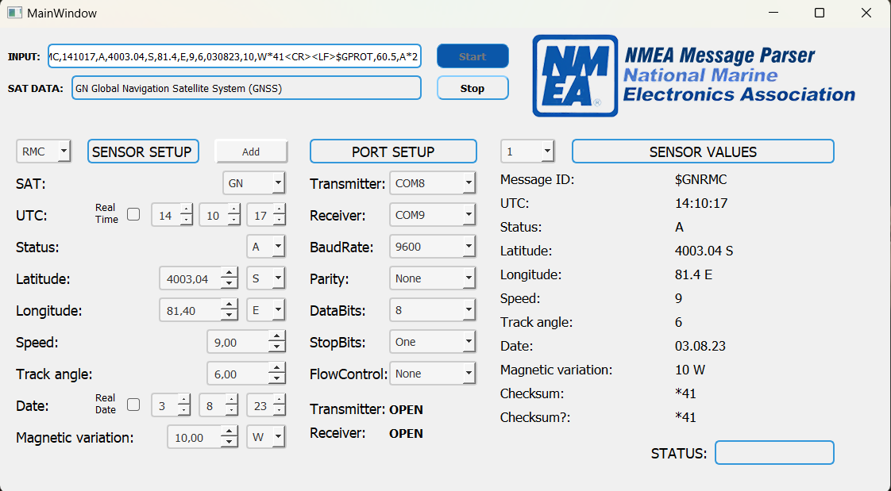
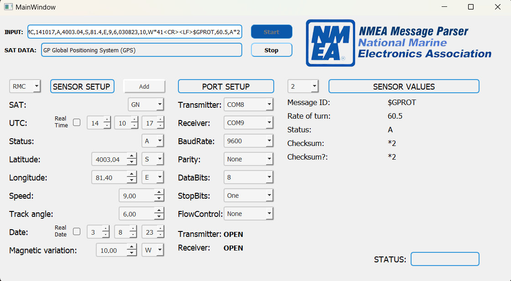
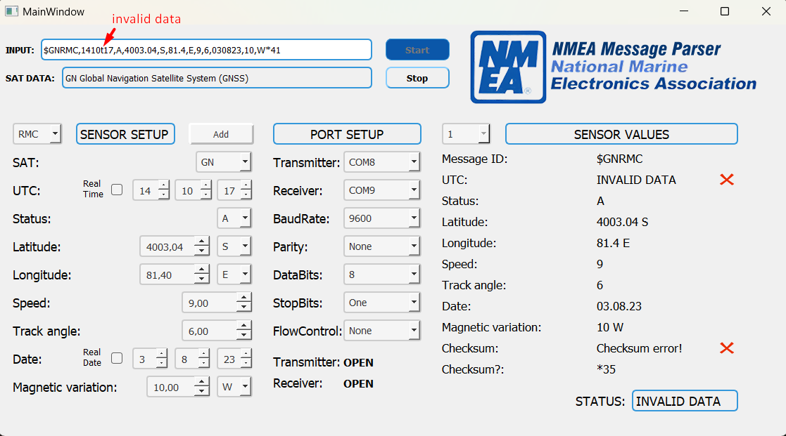

# NMEA Message Parser Project

This project provides a parser for NMEA sentences.

## Supported Sentences

Currently, the project supports the following NMEA sentences:

- **GPRMC**: GPS Recommended Minimum Specific GNSS Data
- **GPROT**: Rate and direction of turn

## Message Examples

Here are some message examples for the supported NMEA sentences:

### GPRMC
$GPRMC,123519,A,4807.038,N,01131.000,E,022.4,084.4,230394,003.1,W*6A

### GPROT
$GPROT,35.6,A*4E

**You can also use multiple messages in one go**:  

`$GPROT,55.5,A*4<CR>LF>$GPROT,35.6,A*4E`  
`$GPROT,35.6,A*4<CR><LF>$GPRMC,123519,A,4807.038,N,01131.000,E,022.4,084.4,230394,003.1,W*6A`  
`$GPROT,55.5,A*4<CR>LF>$GPROT,35.6,A*4E<CR>LF>$GPRMC,123519,A,487.038,N,0111.00,E,022.4,4.4,230394,003.1,W*6A`  

Remember to include `<CR><LF>` or line breaks between each message if needed.

Feel free to contribute and expand the project by adding support for more NMEA sentence types or enhancing the parsing logic!

## Screenshots

